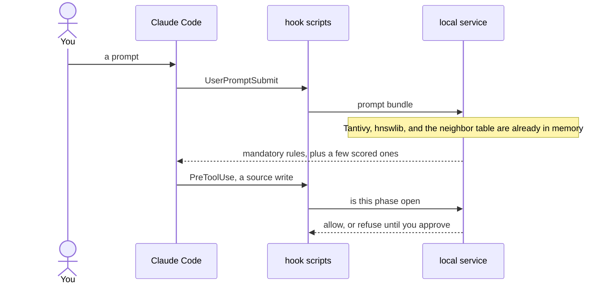

# The core stack

Writty is a plugin for Claude Code. Claude writes the code. Writty decides two things a model is weak at deciding for itself: which engineering rules belong in this turn, and whether a write is allowed yet. The first job is a librarian. The second is a process keeper. Both run on your machine.

Read this page to learn the stack. The exact contracts live in the pages it links.

| Piece | The one job it has here |
|---|---|
| Claude Code | The agent, and the hook points the plugin hangs on |
| Hook scripts | Run Writty's checks before and after each tool call |
| Process keeper | Holds a source write until you approve the plan, then the tests |
| Librarian | Picks the few rules that fit this prompt |
| Local service | Holds the indexes in one warm process the hooks call |
| Neo4j | Stores the rules and the links between them |
| Tantivy | Finds rules by the words in them (BM25) |
| ONNX | Turns a sentence into numbers, so meaning can be compared |
| hnswlib | Finds the rules whose numbers are closest to the prompt |
| Regex passes | Scan a file for patterns a rule forbids, in any language |

When the service starts it reads Neo4j once and builds three in-memory structures: a Tantivy index, a vector index, and a table of each rule's neighbors. A prompt reads those. After that, picking rules is arithmetic.

## Why the stack looks like this

An instruction in the prompt is still an instruction. A long session can compact it away, dilute it, or ignore it, and nothing about the wording makes the violation impossible. Writty keeps the checks it cares about in code that runs at tool time. That is the process keeper.

The other pressure is the size of the rulebook. Pasting every rule into every turn spends the model's attention on rules that do not apply. The librarian's job is the smallest set that does. Keyword search, vector search, and a walk across the rule graph each catch a miss the others make, which is why the retrieval is hybrid. The measured cost of that search, on a warm service, sits well under a millisecond at the 95th percentile. The budget it is held to is 10 ms, in `benchmarks/bench_targets.py`. Where the dated readings live is at the end of this page.

## Claude Code, the harness

A coding agent is a model plus tools: read a file, write a file, run a command. Claude Code is that agent. A harness is the code wrapped around the model so some decisions are made outside it.

Writty's harness is the plugin. `hooks/hooks.json` registers a shell script for each lifecycle event Claude Code already fires. `agents/` defines the helper roles. The scripts talk to a local service over HTTP.

On each event the script can add text to the model's context, or it can refuse the tool. Refusal is the load-bearing part. Claude Code documents that a denying `PreToolUse` hook still blocks when the session is in a permission-bypass mode. Writty uses that event for the write gates.

What each event does: [Hooks](hooks.md).

## The process keeper

In Work mode the session moves through three phases, defined in `writ/session/mode_engine.py`:

1. Planning. Claude may write `plan.md`. Source code stays closed.
2. Testing. You have approved the plan. Claude may write tests. Source code stays closed.
3. Implementation. You have approved the tests. Source writes open.

You approve by typing an approval as the whole message. That keystroke mints a one-time token, and opening the gate spends it. The token comes from your typed message, so the approval is yours.

The gate checks shape: the plan has the required sections, the test file contains assertions. Whether the plan is a good one is your reading. The cycle, the accepted words, and what still blocks after both gates open: [Work gates and approvals](../workflows/work-gates.md).

The other four modes (conversation, debug, investigate, review) do not use this two-gate cycle. Secret files are refused in every mode, including when the service is down.

## The librarian

Hundreds of rules cannot ride along on every prompt. Each prompt asks a small service for a bundle: the mandatory rules that must always be present, plus a handful of others scored against what you just typed and what the agent is doing.

The scored path is five stages in `writ/retrieval/pipeline.py`. Three of them are the hybrid search:

| Stage | Catches | Misses |
|---|---|---|
| BM25, Tantivy | The exact word. "SQL" finds the SQL rule | A paraphrase such as "database queries" |
| Vectors, hnswlib over ONNX | The paraphrase, because the sentences point the same way | A rule that shares no meaning with the prompt, but is the neighbor of a rule that matched |
| Graph neighbors | That neighbor, from a table built at startup | Anything the first two stages never touched |

A ranker in `writ/retrieval/ranking.py` mixes the three scores with how severe the rule is and how confident the corpus is in it. When even the closest vector is a weak match, the pipeline returns no scored rules. Injecting a wrong rule is treated as worse than injecting nothing. That exit is called abstention.

Rules marked mandatory stay out of this search. They travel on a separate path, so a change to the ranking weights, the embedding model, or the graph walk leaves them in place. Both paths are rendered into one block by `writ/retrieval/prompt_bundle.py` and handed to Claude as `--- WRIT RULES ---`.

The full walk, including the methodology companion that does not use embeddings: [Retrieval](retrieval.md). Weights and thresholds: `docs/reference/retrieval.md`.

## Where the pieces meet

Hooks are bash. They must stay short, because Claude Code runs them on the tool-call path. Loading a search engine and a neural net inside each hook would pay a cold start on every prompt.

So one process does the heavy work. `writ serve` (`writ/cli.py`) runs a FastAPI app from `writ/server/__init__.py` on `localhost:8765`. Its startup reads Neo4j, builds the Tantivy index, loads the ONNX model, opens the hnswlib index, and fills the neighbor table. A hook then pays for one HTTP call against a process that is already warm. If that process is down, hooks allow the action through, except secret-file access: an outage must not lock you out of the repository.

Startup order, routes, and health: [Local service](local-service.md).

## Neo4j

A rule is not a row in a list. It conflicts with another rule, depends on a third, belongs to a domain, and a later commit points back at the plan that cited it. Those are edges. Neo4j stores nodes and edges, and answers "what is linked to this" as a query.

Writty runs Neo4j 5 in Docker (`docker-compose.yml`). The database is the canonical copy. `writ-corpus.cypher` is the dump git tracks; install and CI load the database from that file.

Neo4j is the store. Startup copies the edges the librarian needs into the neighbor table in `writ/retrieval/traversal.py`, and a prompt reads that table. Authoring, validation, and the graph explorer talk to Neo4j directly: those paths are rare, and they need the live graph.

What the nodes and edges are: [Rule graph](rule-graph.md). The field-by-field contract: `docs/reference/graph-schema.md`. The library, taught with a query you can reuse: [Neo4j](neo4j.md).

## Tantivy and BM25

BM25 is the formula search engines have used for decades to score a document against a query. A word that appears in few rules counts more than a word that appears in almost all of them. "parameterized" is evidence. "the" is not.

Tantivy is a full-text engine written in Rust, used here through its Python package (`tantivy` in `pyproject.toml`). `writ/retrieval/keyword.py` builds an in-memory index at every service start. The trigger, the condition that should fire the rule, counts double. The body, which is long, counts half, so an explanation does not drown the trigger. A query the parser rejects yields zero keyword hits, and the vector stage still runs.

This stage is how a prompt that names a technology finds the rule that names it too. The library, taught with a three-sentence index: [Tantivy and BM25](tantivy.md).

## ONNX

Comparing meaning needs a sentence turned into a vector: here, 384 numbers. Two sentences about the same thing point roughly the same way. The score is the cosine of the angle between them, from -1 (opposite) to 1 (the same direction).

The model is `all-MiniLM-L6-v2`, a small public sentence model. Writty runs a frozen copy of it with ONNX Runtime (`onnxruntime` in `pyproject.toml`). ONNX is the file format. ONNX Runtime is the program that executes a file in that format, without the training framework. `scripts/export_onnx.py` produces the file; the service loads it from the user cache through `writ/retrieval/embeddings.py`.

Rules are encoded when the index is built. The prompt is encoded when it arrives, and repeated prompts hit a small cache. That encoding is the only model work on the hot path. The model, taught with a cosine you can reproduce: [ONNX embeddings](onnx.md).

## hnswlib

With a few hundred vectors, comparing the prompt to every rule is cheap. The stack is built for a rulebook in the thousands, where that scan would start to show up on every prompt. hnswlib builds a Hierarchical Navigable Small World index: the vectors are linked so that a search walks toward closer neighbors. Writty configures it for cosine distance. The class is `HnswlibStore` in `writ/retrieval/embeddings.py`.

The index is saved under the user cache, with a hash of the rule text beside it. Unchanged text means the next start skips the encode. A hash or checksum mismatch forces a rebuild, so a torn file is never served as if it were the corpus.

The walk is approximate: it can miss a true neighbor. The keyword stage still catches an exact term the walk skipped. The two stages exist so each covers a failure of the other. The index, taught with a four-vector example: [hnswlib](hnswlib.md).

## The six cross-language passes

A rule that says "do not concatenate SQL" is text until something reads the file. `bin/lib/analyzers-regex.sh` reads a source file once and runs six pattern passes. The same patterns apply in every language `bin/run-analysis.sh` recognizes:

| Pass | What it looks for |
|---|---|
| Injection | SQL built by concatenating strings, unsafe HTML sinks, shell and `eval`, insecure deserialization, dynamic templates, interpolated log lines |
| Auth | Weak password hashes, non-cryptographic random tokens, mass assignment, a route handler with no auth check |
| Crypto and headers | Hardcoded secrets, weak ciphers such as AES in ECB, certificate checks switched off |
| Data protection | Personal-data fields named inside a log call |
| N+1 | A database call inside a loop that uses the loop variable |
| Statelessness | A user or session value stored in a module-level global |

`bin/run-analysis.sh` also calls a language tool when one is installed (PHPStan for PHP, and the others in `bin/lib/analyzers-lang.sh`). Those are per language. The six passes above are the cross-language layer: they attach a line number to specific security, performance, and scaling rules.

A pattern match can see a string built into a query. It cannot see that a design is sound. The process keeper stops at the same line: shape is checked by code, judgment stays with you.

## One prompt, end to end

Startup, once per service life: Neo4j, then the three in-memory structures, then requests. A re-seed of the database is invisible until the service restarts, because the indexes are a snapshot.

## The numbers people quote

A 95th percentile of 0.59 ms means: sort 100 searches by duration, and 95 of them finished in that time or less. The figure is the warm in-memory search. Cold start is measured separately, and so is any path that still talks to Neo4j.

`CHANGELOG.md` records the first production reading of this stack: 0.590 ms end to end at the 95th percentile, on a corpus of 276 rules, 30 of them mandatory, grouped at the time into 12 public subjects (security, clean code, DRY, SOLID, architecture, testing, error handling, performance and caching, scaling, API design, process and lifecycle, documentation). `HANDBOOK.md` section 20 records the later reading, taken 2026-08-01: 0.6 ms at the 95th percentile on that day's 287-rule corpus. `SCALE_BENCHMARK_RESULTS.md` is the synthetic curve that asks whether the same search stays cheap at 10,000 rules.

Those counts move. The dump you have checked out states its own totals in the header of `docs/reference/rulebook.md`, domain by domain, including which rules are mandatory. The running service reports what it loaded on `GET /health`. Read the count from those two places.

## Where to go next

- [Neo4j](neo4j.md), [Tantivy and BM25](tantivy.md), [ONNX embeddings](onnx.md), [hnswlib](hnswlib.md): one lesson each, with an example you can lift into another project.
- [Quickstart](../quickstart.md): install, and a first gated task.
- [Retrieval](retrieval.md): the ranked pipeline, abstention, and the mandatory floor.
- [Work gates and approvals](../workflows/work-gates.md): the two approvals and the token.
- `docs/architecture/retrieval-pipeline.html`: the same pipeline as a diagram you can click through.
