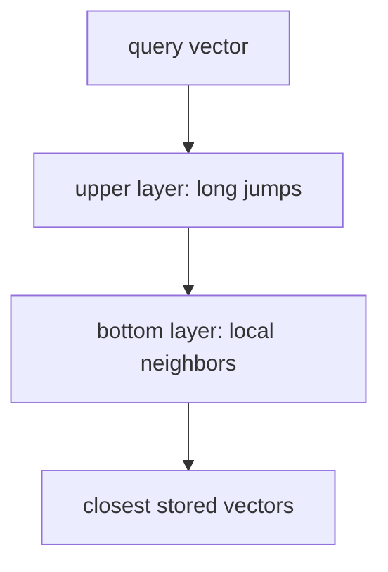

# hnswlib

hnswlib finds the vectors closest to a query without comparing the query to every vector you stored. The index is a graph whose nodes are the vectors. A search walks toward closer neighbors. Reach for it when you already have embeddings and a full scan has started to show up on the request.

This page teaches the idea. The place Writty calls it is `HnswlibStore` in `writ/retrieval/embeddings.py`.

This graph is not the Neo4j graph. Neo4j links rules to rules because a person said they conflict or depend. hnswlib links vectors to vectors because they point in similar directions. Startup builds the second from the output of the first. See [Neo4j](neo4j.md) and [ONNX embeddings](onnx.md).

## The idea

Comparing a query with every stored vector is exact, and it is a loop. At a few hundred vectors the loop is cheap. At tens of thousands, on every prompt, it becomes the request.

A Hierarchical Navigable Small World index adds a second structure. Each vector keeps a small number of edges to other vectors. Upper layers hold a few long-range edges. The bottom layer holds the local neighborhood. Search starts on a sparse upper layer, jumps toward the query, then drops a layer and looks more carefully.



The walk is approximate. It can miss a true neighbor when the edges do not bridge to it. You buy the miss with `ef_search`: a larger candidate list at query time raises the chance of finding the true neighbor, and it does more work. Writty's defaults, in `writ/retrieval/embeddings.py`:

| Parameter | Value | What you are choosing |
|---|---:|---|
| `M` | 16 | How many neighbors each vector keeps. More edges, more memory, a denser walk |
| `ef_construction` | 200 | How wide the search is while the index is built. A one-time cost |
| `ef_search` | 50 | How wide the search is on a query. The knob you turn when recall slips |

`space="cosine"` tells hnswlib to store vectors for cosine distance. The library returns a distance, and Writty converts it back to a similarity with `score = 1.0 - distance`. A cosine of 0.528 (the paraphrase in [ONNX embeddings](onnx.md)) is a distance of 0.472.

## Four vectors you can run

```python
import hnswlib
import numpy as np

vectors = np.array([
    [1.0, 0.0, 0.0, 0.0],  # 0, identical to the query
    [0.9, 0.1, 0.0, 0.0],  # 1, nearby
    [0.0, 0.0, 1.0, 0.0],  # 2, orthogonal
], dtype=np.float32)

index = hnswlib.Index(space="cosine", dim=4)
index.init_index(max_elements=3, ef_construction=200, M=16)
index.set_ef(50)
index.add_items(vectors, [0, 1, 2])

labels, distances = index.knn_query([[1.0, 0.0, 0.0, 0.0]], k=2)
# labels[0] is [0, 1]. The identical vector has distance 0.
```

At three vectors the graph is too small to miss anyone, so this example is exact. It is still the real API: `Index`, `init_index`, `add_items`, `knn_query`. The ids you pass to `add_items` are what `knn_query` returns. Writty uses `0 .. n-1` and keeps its own dict from that integer to a rule id (`_id_to_rule` in `HnswlibStore`).

`max_elements` is a capacity, set at `init_index`. Adding past it means rebuilding. Writty sets it to the number of rules being indexed, because the corpus is known at startup.

## How Writty uses it

`HnswlibStore.build_index` creates the index, then `add_items` with the rule embeddings. `search` asks for the top k and maps labels back to rule ids. The pipeline asks for 10 neighbors. Mandatory rules never enter this index. They have their own path, described in [Retrieval](retrieval.md).

The index is saved under the user cache as `writ_hnsw.bin`, with a JSON sidecar. The sidecar carries a hash of the rule text and a SHA-256 of the bin file. On the next start, a matching pair is loaded and the encode is skipped. A mismatched hash or checksum rebuilds. The bin is renamed into place before the sidecar, so a reader sees either the previous pair or a checksum failure, never a new sidecar pointing at an old bin (`save_index` in `writ/retrieval/embeddings.py`).

That file pair is the lesson, more than the library. An approximate index is a cache of a function (texts in, neighbors out). Persist the identity of the inputs next to it, and refuse to serve a pair you cannot verify.

## Where this pays off in another project

Use hnswlib when three things are already true: you have vectors, they live in one process, and a brute-force scan is on the profile. Similar-document search, "have we seen this support ticket", and a local recommendation step all look like `knn_query`.

Below that size, store the vectors in a matrix and multiply. The code is shorter, the result is exact, and there is no `ef_search` to explain. Writty still uses hnswlib at today's corpus because the same code has to stay fast if the rulebook grows into the thousands. The curve for that bet is `SCALE_BENCHMARK_RESULTS.md`. The per-stage budget the search is held to lives in `benchmarks/bench_targets.py`.

Two habits keep an approximate index honest.

- Measure recall, not only latency. Take a sample of queries, compute the true nearest neighbors by a full scan, and record how often the walk returns them. If recall drops, raise `ef_search` before you touch anything else.
- Keep an exact signal beside the walk when a miss is expensive. Writty's exact signal is the Tantivy stage: an identifier or a rare token still matches even if the walk stepped past that vector. See [Tantivy and BM25](tantivy.md).

Another library (faiss, a vector database, a SQL extension) is the same algorithm with a different operational shape. The questions to ask of it are the ones on this page: what does the distance mean, what is stored beside the index so you know which corpus it came from, and what happens when the walk misses.

## Where to go next

- [The core stack](core-stack.md): how the walk joins the keyword stage and the neighbor table.
- [ONNX embeddings](onnx.md): where the vectors come from.
- [Retrieval](retrieval.md): how a neighbor becomes a rule in the prompt.
