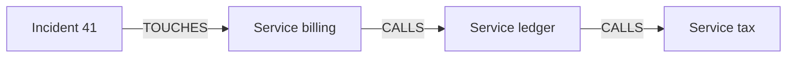

# Neo4j

Neo4j stores things and the links between them, and answers questions about those links in one query. Reach for it when the question keeps changing shape: what depends on this, what cites it, what else sits two hops away. A fixed report with two joins can stay in a table.

This page teaches the idea. The node and edge contract for Writty is [Rule graph](rule-graph.md) and `docs/reference/graph-schema.md`.

## The idea

A row is a thing with columns. A graph is a thing with named arrows to other things.



"If billing breaks, which services feel it, up to three hops?" is a walk along `CALLS`. In a relational schema the same question is a query you rewrite every time the depth changes. In a graph the depth is a parameter.

## A query you can reuse

Cypher is Neo4j's query language. Parentheses are nodes, arrows are relationships, and `$name` is a parameter (pass the value from code, so a name never becomes part of the query text).

```cypher
MATCH (start:Service {name: $name})-[:CALLS*1..3]->(dep)
RETURN DISTINCT dep.name AS name
```

`*1..3` means one, two, or three hops. The same pattern finds "rules that conflict with a rule this plan cited" or "services this deploy will touch". You change the labels and the relationship type. You keep the shape.

The official Python driver speaks Bolt, Neo4j's binary protocol. Writty opens it once, in `writ/graph/db/__init__.py`:

```python
from neo4j import AsyncGraphDatabase

driver = AsyncGraphDatabase.driver(uri, auth=(user, password))

async with driver.session(database="neo4j") as session:
    result = await session.run(
        """
        MATCH (start:Service {name: $name})-[:CALLS*1..3]->(dep)
        RETURN DISTINCT dep.name AS name
        """,
        name="billing",
    )
    rows = await result.data()
```

The `Service` model above is a lesson, not a Writty label. The driver call is the same shape as `build_from_db` in `writ/retrieval/traversal.py`.

## How Writty uses it

Writty runs Neo4j 5 in Docker (`docker-compose.yml`, browser on port 7474, Bolt on port 7687). The database is the canonical copy of the rules. `writ-corpus.cypher` is the dump git tracks, and install loads the database from that file.

Two kinds of nodes share one graph:

| Kind | Examples | Question it answers |
|---|---|---|
| Doctrine | `Rule`, `Skill`, `Playbook` | Which engineering rule applies, and which skill teaches it |
| Records | `Decision`, `FileChange`, `Commit` | Under which plan and which rules did this change land |

Edges are an allowlist, `ALLOWED_EDGE_TYPES` in `writ/graph/db/_common.py`. A rule `DEPENDS_ON` another, `CONFLICTS_WITH` a third, `BELONGS_TO` a category. A commit connects back through `GOVERNED_BY` and `HAS_COMMIT`. An edge whose type is absent from that set is rejected in the Python wrapper before it reaches Cypher.

One real neighborhood, readable in the Neo4j browser once the container is up:

```cypher
MATCH (r:Rule {rule_id: 'SEC-INJ-SQL-001'})-[e]-(m)
RETURN type(e) AS edge, labels(m)[0] AS kind, m.rule_id AS id
```

## The pattern worth copying

Writty does not ask Neo4j on the prompt path. Startup runs one Cypher query that reads every edge, then stores the neighborhood in a dict (`writ/retrieval/traversal.py`). A prompt does a dictionary lookup. Authoring, validation, and the graph explorer still talk to Neo4j, because those are rare and they need the live graph.

That split travels. Put the graph where the relationships are the product. Copy the slice a hot request needs into memory, and treat the copy as a snapshot: after you write to the database, rebuild the copy or the hot path keeps serving the old neighborhood.

## Where this pays off in another project

Use a graph when you keep asking "what is connected to this" and the path length is part of the question. Service maps, permission graphs, citation graphs, and provenance (this release, those commits, those decisions) all have that shape.

A table remains the better store when the question is "this entity, these columns" and the joins are fixed in the schema. Neo4j still costs an operational piece: a container, backups, and a dump you can rebuild from, which is the role `writ-corpus.cypher` plays here.

## Where to go next

- [The core stack](core-stack.md): where Neo4j sits among the other pieces.
- [Rule graph](rule-graph.md): Writty's labels and how a rule becomes canon.
- [Tantivy and BM25](tantivy.md): the keyword index built from the same rules at startup.
