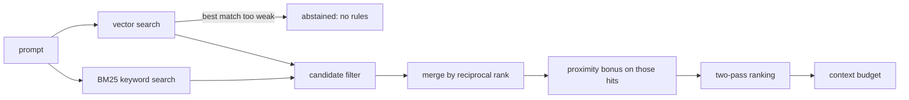

# Retrieval

Retrieval picks the few nodes of the [rule graph](rule-graph.md) worth putting in front of the model on this turn. Each prompt costs one daemon call: `writ-rag-inject.sh` posts to `/prompt-bundle`, which runs every channel in-process and renders one block (`writ/retrieval/prompt_bundle.py`). The exact constants and weights are in `docs/reference/retrieval.md`; the illustrated walk-through is `docs/architecture/retrieval-pipeline.html`.

## Two channels

- **Ranked, plus the floor.** A search pipeline scores non-mandatory rules and the retrievable methodology types against the prompt (`/query`). Beside it, the always-on floor injects mandatory and always-on rules without ranking them (`/always-on`).
- **The deterministic companion.** Methodology nodes chosen by workflow state, with no embeddings (`/methodology-companion`).

The four companion types (`Skill`, `Playbook`, `Technique`, `AntiPattern`) also sit in the ranked pool. "Methodology is never ranked" is true of the companion channel only.

## The ranked pipeline

Everything is built at daemon startup, so a query does no disk or graph I/O. `RetrievalPipeline.query` in `writ/retrieval/pipeline.py`:

- **Keyword and vector search.** A Tantivy BM25 index (`writ/retrieval/keyword.py`) and an hnswlib vector index over ONNX embeddings (`writ/retrieval/embeddings.py`). Both are cached on disk and reopened when their corpus hash matches. BM25's hash covers the fields it indexes (`_compute_bm25_hash` in `writ/retrieval/pipeline.py`). An in-memory BM25 index is the fallback when that cache cannot be written.
- **Candidate filter.** Keeps the node types, domain and route the query asks for, and drops records from other projects (`writ/retrieval/node_scope.py`).
- **Graph neighbors.** The candidate list is already fixed, from keyword and vector only. An in-memory adjacency cache (`writ/retrieval/traversal.py`) then does two quieter jobs: a proximity bonus reranks a candidate that sits one or two hops from a top seed, and the full render names neighbor ids on a `RELATED` line. A rule neither search returned is not added.
- **Two-pass ranking.** A first pass without the graph picks the top seeds; the second adds a bonus for nodes one or two hops from a seed. The weights are code constants in `writ/retrieval/ranking.py`, not configuration.
- **Context budget.** Picks how much of each rule to render. When the budget is tight, an `Abstraction` summary can stand in for the rules it covers.

## Abstention

When even the best vector match is weak, the pipeline returns no rules rather than a wrong one. The cut-off is `RULE_INJECTION_ABSTENTION_THRESHOLD` = 0.30 (raw cosine similarity, in `writ/retrieval/pipeline.py`).

The gate is opt-in at the call site. The daemon and `writ query` turn it on; authoring and offline diagnostics build the same pipeline without it. Every response carries `abstain_signal`, the best raw score, so the threshold can be retuned from logs.

## The always-on floor

A ranking can drop a rule on a bad day. Rules that must never drop are kept out of ranking altogether. Two Cypher predicates in `writ/graph/predicates.py` decide the split:

- `INJECTION_RULE_WHERE` selects the floor: every rule that is mandatory or flagged always-on. Every `ForbiddenResponse` joins it.
- `RANKED_INCLUDE_WHERE` selects the ranked pool: every rule that is not mandatory.

A mandatory rule is therefore always injected and never ranked. `writ validate` imports the same two predicates to check that no mandatory rule is stranded between the channels. Why the split exists: `HANDBOOK.md` section 10.

The floor is narrowed, never trimmed silently. A rule can declare where it applies (prompt, write, bash) and the keywords that trigger it. A rule with no such data applies everywhere.

## The methodology companion

`MethodologyTriggerIndex` in `writ/retrieval/trigger_index.py` matches methodology nodes on fields they carry themselves:

- **Floor**: the nodes a mode always needs. Never dropped for budget.
- **Push**: nodes fired by an observable action, such as a sub-agent dispatch or a gate denial.
- **Pull**: nodes whose trigger keywords appear in the prompt. Trimmed first when over budget.

The daemon builds this index at startup, next to the pipeline ([Local service](local-service.md)).
