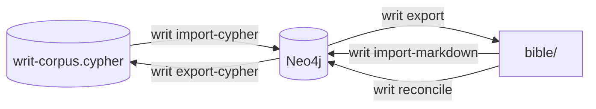
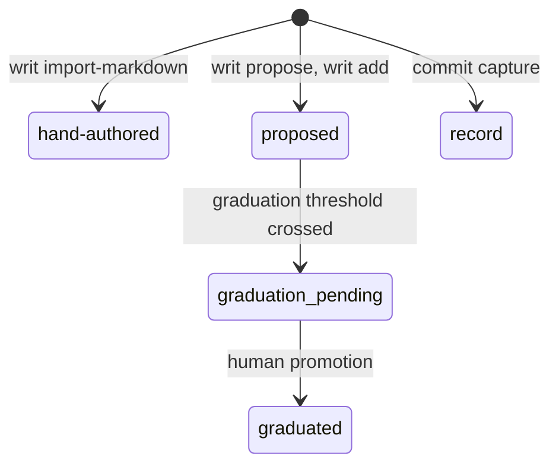

# Rule graph

One Neo4j graph holds everything Writty knows. Doctrine is the rules and methodology the model is shown. Records say why files changed. The daemon builds its indexes from the graph at startup. The full contract, every field and edge, is `docs/reference/graph-schema.md`; the operator view is `HANDBOOK.md` sections 9 to 13.

## Node types

Every doctrine type is registered once, in `NODE_TYPE_MODELS` in `writ/graph/schema.py`. What sets them apart is how they reach the model:

| Reaches the model through | Types |
|---|---|
| The ranked pipeline, or the always-on floor when mandatory | `Rule` |
| The always-on bundle and the ranked pipeline | `ForbiddenResponse` |
| The methodology companion and the ranked pipeline | `Skill`, `Playbook`, `Technique`, `AntiPattern` |
| Summary mode: replaces raw rules when the context budget is tight | `Abstraction` |
| Only as a graph neighbor of a node already retrieved | `Phase`, `Rationalization`, `PressureScenario`, `WorkedExample` |
| Only `GET /subagent-role/{name}` | `SubagentRole` |
| Never retrieved: routing data | `Category` |

The channels are explained in [Retrieval](retrieval.md).

Typed edges connect the nodes: dependencies, conflicts, supersession, methodology that teaches or counters a rule, a playbook that dispatches a sub-agent role. The allowlist is `ALLOWED_EDGE_TYPES` in `writ/graph/db/_common.py`, and each edge type is created through a wrapper that checks its endpoints. Authors declare most edges in the source. Ingest derives `RELATED_TO` from rule ids mentioned in prose and `BELONGS_TO` from categories; `writ compress` writes `ABSTRACTS`. Retrieval walks these edges in its graph stage. List and invariants: `docs/reference/graph-schema.md` section 2.

## Where the corpus lives

Neo4j is canonical. Two copies of the corpus live outside it:

- `writ-corpus.cypher`, tracked: a deterministic dump of the graph. Install and CI seed Neo4j from it.
- `bible/`, not tracked: a Markdown export for reading and editing, regenerated from the graph.

- `writ import-cypher` wipes the graph first, because the dump's CREATE statements are not idempotent. It keeps decision records unless the dump carries them (`writ/graph/dump.py`).
- `writ import-markdown` only adds and updates, then re-exports `bible/` unless given `--no-export`. It never deletes, so a rule renamed in `bible/` leaves the old one in the graph.
- `writ reconcile` is the one command that prunes. It imports, then deletes the nodes, edges and fields the Markdown no longer has. It spares proposed candidates and records, and refuses an empty source. Run it on the full corpus only: a partial source loses everything it omits.
- After changing the graph, `writ export-cypher` refreshes the tracked dump. Restart the daemon so its indexes see the change ([Local service](local-service.md)).

One exception to "the graph is canonical": a short list of rules lives canonically as files under `bible/methodology/` (`_METHODOLOGY_CANONICAL_RULE_IDS` in `writ/export.py`). Editing those files by hand is safe.

`writ validate` runs the integrity checks in `writ/graph/integrity/`: structure, reachability of mandatory rules, graph against Markdown parity, and content. Any finding fails the run unless its check is marked advisory. Details: `docs/reference/graph-schema.md` section 4.

## How a rule becomes canon

Every node carries a `provenance`, the stage of its words in this lifecycle:

- `hand-authored` is the corpus at rest: a node ingested from Markdown.
- `writ propose` (or `POST /propose`) runs a new rule through the structural gate in `writ/gate.py`. An accepted proposal, like a rule from `writ add`, lands in the graph only, as `proposed`. With no Markdown home yet, reconcile spares it.
- Each `POST /feedback` on a proposed rule re-checks its counts. Past the threshold in `writ/frequency.py`, the rule flips to `graduation_pending` (`evaluate_and_flip_graduation` in `writ/graph/db/rule_store.py`). The flip changes nothing else: the rule is a candidate, not canon. The threshold is a plain ratio of positive observations, with no statistical smoothing.
- Only a human makes a candidate canon: `writ review --promote`, backed by the token-gated `POST /session/{session_id}/promote-candidate`. `writ/promotion.py` shows the candidate beside the rules it might conflict with, lets the human edit it, stamps it `graduated`, and exports it to `bible/methodology/`.
- `writ review --reject` deletes a candidate that is still AI-provisional.
- `record` stands apart. Decision records are born in it and never move.

Step by step, with the thresholds: `docs/reference/graph-schema.md` section 5.

## Records beside the rules

Decision memory stores why each file changed: a `Decision` for the approved plan, a `FileChange` per file per commit with its reason, the `Commit`, and a `Project` registry. The post-commit git hook sends each commit to `POST /commit/capture`. `writ harvest` backfills history, and `writ recall` plays recent decisions back. Claude Code's auto-memory files are mirrored as `Memory` nodes through `POST /memory-record`.

None of these ever enters retrieval. They are absent from every retrieval registry on purpose. Contract: `docs/reference/decision-memory.md`.

## One graph, many projects

Every project on the machine shares one graph. Doctrine is universal: `Rule` and the retrievable methodology types reach every project. Records are private: a caller sees its own project's records and those tagged `_shared`. The split is by node type, an explicit allowlist (`DOCTRINE_NODE_TYPES` in `writ/retrieval/node_scope.py`). A new node type stays private until someone adds it there.
