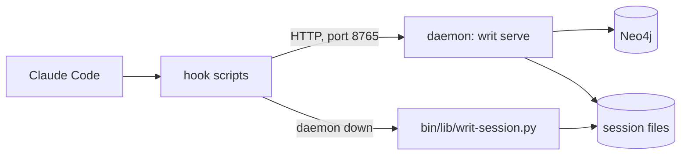
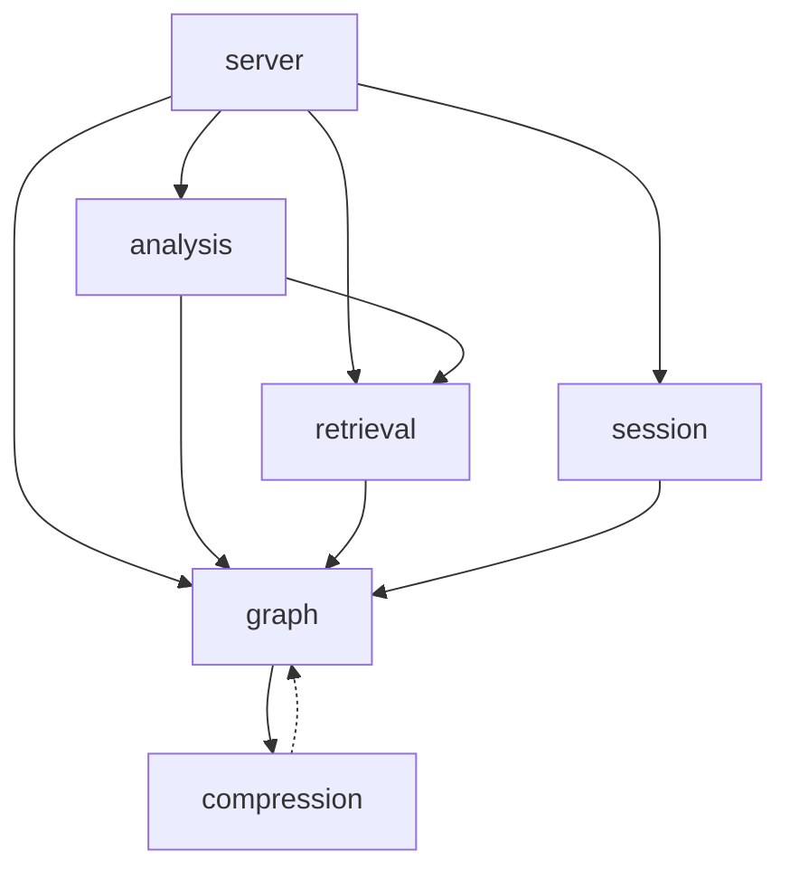

# Module topography

Writty is two layers. Bash hooks under `hooks/` run inside Claude Code and decide in milliseconds. The Python package `writ/` holds everything slower: a local HTTP service (the daemon), the session state, the rule graph access and retrieval. A hook talks to the daemon over HTTP and falls back to a Python helper when the daemon is down.

## Runtime path



- Claude Code runs the scripts that `hooks/hooks.json` registers. See [Hooks](hooks.md).
- `_writ_session` in `bin/lib/common.sh` tries the daemon first with a short curl timeout, then runs `bin/lib/writ-session.py` as a subprocess. That helper imports `writ/session/` directly, so it reads and writes the same state without the daemon.
- The daemon is `writ serve` (`writ/cli.py`), started on demand by `scripts/lib/writ-server-lib.sh`. See [Local service](local-service.md).
- Session state lives in files under `~/.cache/writ/session`, one store per user (`writ/session/cache.py`). Rules live in Neo4j. See [Rule graph](rule-graph.md).

## Top-level inventory

| Path | Holds |
|---|---|
| `writ/` | The Python package: daemon, CLI, session state, graph access, retrieval |
| `hooks/` | `hooks/hooks.json` and the bash scripts it wires into Claude Code events |
| `bin/` | `bin/writ` and `bin/lib/`, the helpers hooks share: `bin/lib/common.sh`, `bin/lib/writ-session.py`, `bin/lib/approval_match.py`, `bin/lib/gate-categories.json` |
| `scripts/` | Daemon lifecycle (`scripts/ensure-server.sh`, `scripts/lib/writ-server-lib.sh`), `scripts/render-docs.py`, the Workflow scripts, maintenance |
| `agents/` | Sub-agent definitions, one Markdown file per role |
| `templates/` | Files installed into a user's setup: `templates/settings.json` (rendered from `hooks/hooks.json`), plan and capabilities templates, commands |
| `rules/` | Two stubs pointing at methodology nodes that replaced them |
| `writ-corpus.cypher` | The tracked dump of the rule graph. Install and CI seed Neo4j from it |
| `tests/` | The pytest suite. See the testing section |
| `benchmarks/` | Retrieval quality and scale benchmarks |
| `docs/` | `docs/reference/` contracts, `docs/adr/` decisions, `docs/architecture/` HTML pages, handoffs |
| `openwiki/` | This wiki |
| `.claude-plugin/` | `.claude-plugin/plugin.json` and `.claude-plugin/marketplace.json` |
| `.claude/` | Repo-local commands and skills, such as `.claude/commands/writ-approve.md` |
| `.github/` | CI: `.github/workflows/pr.yml` and `.github/workflows/publish.yml` |
| `docker-compose.yml`, `writ.toml.example`, `Makefile` | Neo4j container, configuration reference, developer targets |

Not tracked: `bible/` (a Markdown export of the graph, regenerated with `writ export`), `var/` and `cache/`.

## The writ subpackages

| Package | Does | Read first |
|---|---|---|
| `writ/server/` | The FastAPI daemon: app, startup, and one router module per domain under `writ/server/routes/` | `writ/server/__init__.py` |
| `writ/session/` | Session state: modes, phases, gates, approvals, the session cache, and decision-memory capture | `writ/session/mode_engine.py` |
| `writ/graph/` | The graph contract: node models, Neo4j store (`writ/graph/db/`), ingest, dump, the floor predicates, integrity checks (`writ/graph/integrity/`) | `writ/graph/schema.py` |
| `writ/retrieval/` | Picks the rules for a prompt: ranked pipeline, embeddings, keyword index, the always-on floor, the methodology companion, the prompt bundle | `writ/retrieval/pipeline.py` |
| `writ/analysis/` | Code compliance behind `/analyze`, friction-log analysis, token audit, efficacy A/B | `writ/analysis/analyzer.py` |
| `writ/compression/` | Builds Abstraction nodes (rule summaries) by clustering, for `writ compress` | `writ/compression/abstractions.py` |
| `writ/shared/` | Logging, token estimates, the hook delivery table, the budget file | `writ/shared/logging.py` |

Modules directly under `writ/`:

| Module | Does |
|---|---|
| `writ/cli.py` | The `writ` command (Typer). Every subcommand, `writ serve` included |
| `writ/config.py` | Loads `writ.toml`. Other modules read configuration through it |
| `writ/gate.py` | The structural gate a proposed rule must pass |
| `writ/promotion.py` | The human-gated step that turns a graduated candidate into canon |
| `writ/frequency.py` | Decides when a proposed rule has enough observations to graduate |
| `writ/authoring.py` | Helpers for `writ add`, `writ edit`, `writ review`, `writ propose` |
| `writ/origin_context.py` | Write-once store of the context a rule was proposed in |
| `writ/export.py` | Writes `bible/` from the graph |
| `writ/dashboard.py` | Renders the friction dashboard as HTML |
| `writ/hooks_lint.py` | Flags hooks whose output would never reach the model |

## Import edges



- `writ/server/` sits on top and imports every other package except `writ/compression/`. Inside `writ/`, only `writ/cli.py` imports it; `scripts/render-docs.py` also reads its route table to generate `docs/reference/http-api.md`.
- `writ/graph/` is the base the others build on. Among the subpackages it imports only `writ/compression/` and `writ/shared/`.
- `writ/shared/` is imported by analysis, graph, retrieval, server and session, so the chart leaves it out. It is not a leaf: `writ/shared/logging.py` imports `writ.session.git_identity` at module top, and `writ/session/` imports `writ/shared/` widely. That is a real cycle between the two packages. It holds because `writ/session/git_identity.py` imports only the standard library.
- `writ/graph/` and `writ/compression/` import each other, but graph does it inside functions and compression only for type hints (the dashed edge). Nothing cycles at import time.
- `writ/cli.py` imports `writ/config.py` and `writ/session/` at module top, and every other package inside the command that needs it.

## Refreshing this graph

Every edge above comes from this loop, run at the repo root. It prints one line per edge with the number of files that carry the import:

```
for a in analysis compression graph retrieval server session shared; do
  for b in analysis compression graph retrieval server session shared; do
    [ "$a" = "$b" ] && continue
    n=$(grep -rlE "^\s*(from|import)\s+writ\.$b\b" writ/$a | wc -l | tr -d ' ')
    [ "$n" != "0" ] && echo "$a -> $b ($n files)"
  done
done
```

`tests/openwiki/test_architecture.py` fails when the chart draws an edge the imports do not back, or when a new subpackage is missing from the table.
