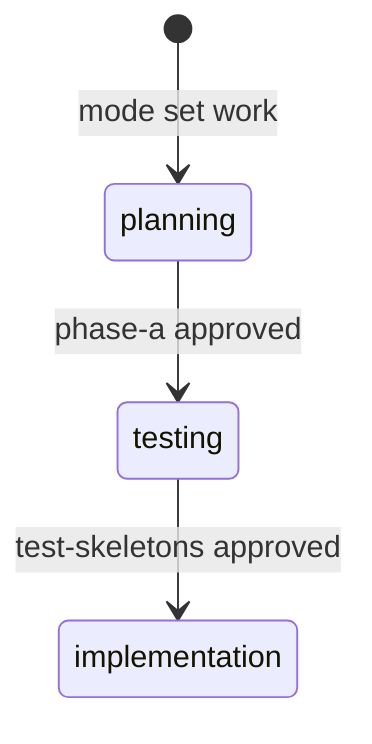
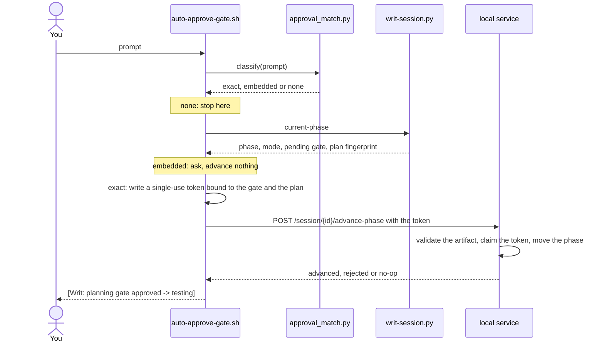

# Work gates and approvals

In `work` mode, Claude cannot write source code until you approve two things, in order: the plan, then the tests. You approve by typing it. Claude cannot approve for you.

## The cycle

| Phase | Gate to leave it | What the gate checks |
|---|---|---|
| `planning` | `phase-a` | `plan.md` has Files, Analysis, Rules Applied and Capabilities sections, and every rule id it cites was really loaded this session |
| `testing` | `test-skeletons` | a test file with a test method exists (`_validate_test_skeletons` in `writ/session/approval_workflow.py`). Assertions are checked later, on a source write, by `hooks/scripts/validate-test-file.sh` |
| `implementation` | none | source writes flow; `plan.md` is locked |

Some files stay writable in every phase: tests, migrations, Markdown and the other patterns under `exclusions` in `bin/lib/gate-categories.json`. Secret files (`.env`, keys) are refused in every mode, whatever the phase.

The checks confirm shape, not quality. A regex cannot tell a real plan from a hollow one. The real check is you reading the plan and the tests before you approve.

## How an approval advances a gate

Type the approval as the whole message. `hooks/scripts/auto-approve-gate.sh` runs on every prompt:

The advance only happens in `work` mode with a gate pending. Anywhere else, an approval word advances nothing.

## Approval examples

| You type | Result | Why |
|---|---|---|
| `approved` | advances | the whole prompt is the word approved |
| `lgtm` | asks | a strong approval word on its own is no longer enough to advance; the hook asks |
| `yes` | nothing | ordinary acknowledgement mints nothing and asks nothing |
| `approuvé` | nothing | near-spellings are not accepted |
| `approuvé !` | nothing | near-spellings are not accepted |
| `approved, and add a test for the empty case` | asks | an approval word inside a longer prompt: the hook asks, nothing advances |
| `ok remember we want to fix all our findings, approved` | asks | an approval word inside a longer sentence: the hook asks whether you meant the pending gate |
| `is this approved?` | nothing | a question is not an approval |
| `not approved` | nothing | a negated approval is not an approval |

## One approval, one gate

- Each approval mints one token, and one advance spends it. Two gates take two approvals.
- A rejected advance spends the token too, because the artifact has to change. Fix it, then approve again. The hook says when an approval was not spent.
- `/writ-approve` and `writ-approve` are exact approvals, the same as `approved`. The command file is `.claude/commands/writ-approve.md`.
- When the local service is down, writes are let through but no gate can advance.
- Approvals belong to the session that earned them. A new session approves again.

## After the gates

- **A rule broken after approval.** Every written file is checked afterward. A confirmed violation of a rule that was loaded at planning time withdraws the plan approval: the next write is blocked until you approve a corrected plan. Three rounds escalate with a diagnosis of what kept failing.
- **A critical review.** While `writ-reviewer` findings marked CRITICAL stand, `git commit` asks you to confirm. See [Sub-agents](sub-agents.md).
- **The next task.** A finished task leaves the session in `implementation`. Run `mode set work` to start the next one at `planning`, and replace the old `plan.md`.

## Where to read more

- `HANDBOOK.md` sections 6 and 7: the gates and why the agent cannot approve itself.
- `docs/reference/session-and-gates.md` sections 3 to 5: the exact validator rules and the token lifecycle.
- `bin/lib/approval_match.py`: the full word list and the matching rules.
